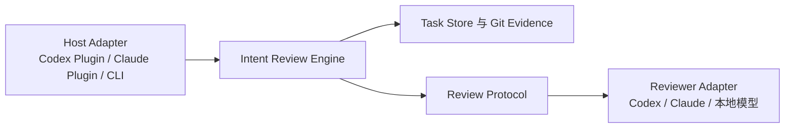
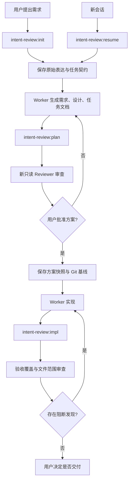

# 技术设计

## 1. 设计目标

Intent Review 在 Worker 与最终交付之间增加一个独立、只读、可追踪的审查层。产品核心是宿主无关的本地任务审查引擎，Codex 插件只是首个薄适配器。首版优先验证两个核心问题：能否在编码前发现方案偏差，以及能否在实现后证明需求覆盖和识别范围漂移。

设计遵循以下原则：

1. 原始意图高于方案，方案高于实现解释。
2. Reviewer 获取证据，不继承 Worker 的推理过程。
3. 确定性信息由工具收集，判断性问题交给 Reviewer。
4. Reviewer 只提出发现，不直接修改文件。
5. Reviewer 提供者可替换，但任务和报告协议保持稳定。
6. Task 是持久化边界，聊天 Session 只是 Task 的一次工作入口。

产品分为三层：



只有 Engine 可以改变 Task 状态。Host Adapter 负责入口和展示，Reviewer Adapter 负责调用模型，两者都不是任务事实来源。

## 2. 首版产品流程



首个 Codex Host Adapter 提供四个主要技能：

- `intent-review:init`：创建任务并保存意图契约。
- `intent-review:resume`：在新会话中恢复 Task、有效约束和当前阶段。
- `intent-review:plan`：审查方案，并在用户批准后冻结快照。
- `intent-review:impl`：审查实现、验收覆盖和改动范围。

状态和历史直接通过任务目录读取，不单独实现 Dashboard。首版不持续监听 Worker 的每一步操作，只在“方案生成后、改代码前”和“改完代码后、提交前”执行强审查。

## 3. 组件架构

### 3.1 Intent Review Engine

Engine 提供稳定的本地命令/API，负责 Task 生命周期、证据构建、审查调度、预算控制、Schema 校验和用户裁决。所有状态计算都在确定性代码中完成，不依赖 Skill 的自然语言上下文。

Engine 对 Host Adapter 暴露命令行接口，使用结构化参数或请求文件输入，并以 JSON stdout 返回结果。具体实现语言和分发形态必须在 Runtime Spike 后、正式实现前确定；选型必须同时评估额外运行时依赖、插件打包方式、三平台支持和中文路径。首版可以接受明确声明的运行时依赖，但不得把该决定推迟到发布阶段。

### 3.2 Host Adapter

Host Adapter 负责从当前宿主收集用户明确授权的上下文、调用 Engine、启动或连接 Reviewer，并向用户展示报告。首版实现 Codex Plugin；后续可以增加 Claude Code Plugin 或纯 CLI 入口，而不迁移 Task 数据。

Skill 只描述交互流程，不自行推断 Task 状态。新会话恢复规则如下：

1. 用户提供 Task ID 时精确恢复。
2. 当前仓库和分支只有一个活跃 Task 时可以自动恢复，并明确告知用户。
3. 存在多个候选 Task 时必须列出候选，不得猜测。
4. 恢复后展示目标、禁止项、已批准决策、当前阶段和下一审查点的短摘要。

### 3.3 Task Store

使用项目内 `.intent-review/tasks/<task-id>/` 保存：

```text
.intent-review/tasks/<task-id>/
  task.json
  source.md
  contract.md
  decisions.jsonl
  plan/
    inputs.json
    snapshot/
    review-r1.json
    review-r1.md
  implementation/
    baseline.json
    review-r1.json
    review-r1.md
  runs/
    <run-id>.json
```

- `source.md`：尽量逐字保存用户原始消息和补充要求。
- `contract.md`：当前有效目标、非目标、约束、禁止项和待确认假设。
- `decisions.jsonl`：只追加的用户裁决和契约变更记录。
- `snapshot/`：用户批准时复制的方案文件，后续审查不读取被静默改写的版本作为基准。
- `baseline.json`：批准时的 Git HEAD、工作区状态和文件哈希。

`task.json` 至少保存稳定 Task ID、仓库标识、创建分支、当前阶段和关联 Session 列表。Session ID 只用于追踪来源，不参与决定任务真相。

Task ID 使用 `YYMMDD-<slug>-<short-id>`，其中 `short-id` 由 Engine 生成，避免同日同名任务冲突。用户可使用完整 Task ID 精确恢复。

任务目录默认保存在仓库根目录 `.intent-review/` 并加入 `.gitignore`，用于本机跨 Session 恢复，但不进入业务 Git Diff。首版不自动提交 Task Store；后续可以提供显式导出能力，让用户选择将契约、快照或裁决记录纳入仓库。

如果 Spike 证明修改项目 `.gitignore` 不适合某些宿主，允许使用全局忽略或 `.git/info/exclude` 作为等价实现，但必须满足两个不变量：Task Store 可由 Engine 稳定定位，且默认不参与业务文件范围审查。

### 3.4 Evidence Builder

Evidence Builder 只负责收集可验证事实：

- 原始需求与当前契约。
- 仓库中的 `AGENTS.md`、`CLAUDE.md` 或用户指定规则。
- 方案文件及其快照哈希。
- Git 基线、当前状态、变更文件和 Diff 统计。
- Reviewer 主动请求的相关代码、测试和配置文件。
- 已执行测试的命令、退出状态和摘要。

Evidence Builder 使用两条独立证据管线：

```text
Task Evidence
  → 由 Task Store 使用显式路径读取
  → 不应用仓库 .gitignore、.ignore 或默认扫描排除规则

Repository Evidence
  → 通过 Git 和仓库扫描发现
  → 应用仓库忽略规则、路径范围与按需读取策略
```

两类证据都必须应用路径边界、敏感信息检测、外部发送策略和 Token 预算。Task Evidence 绕过的是仓库文件发现规则，不是安全规则。Git 变更地图必须排除 Task Store 和运行产物，避免工具自身文件进入文件范围矩阵。

大型 Diff 不直接全部嵌入提示词。Evidence Builder 提供文件清单、统计和读取范围，让 Reviewer 在只读仓库中按需检查。

### 3.5 Review Orchestrator

Review Orchestrator 创建全新的 Reviewer 任务，传入稳定的 Review Request，并验证输出格式。它不负责接受发现或修改代码。

首版默认使用新的 Codex Reviewer：

- 新上下文。
- `sandbox_mode = "read-only"`。
- 高推理强度 Reviewer 配置。
- 不传递 Worker 的隐藏推理和聊天摘要，只传 Evidence Pack。

在正式实现前执行 Runtime Spike。首选路径是 `codex exec`，因为它支持默认只读沙盒、JSONL 事件、JSON Schema 输出和 Token Usage；Spike 同时验证认证复用、超时清理、`git diff`、中文路径和插件内嵌套调用。若该路径不满足取消或生命周期要求，再评估 Codex App Server 或 SDK。任何候选都无法同时满足新上下文、只读、结构化输出和可控终止时，必须先修订本节和产品交互，不得继续实现 Orchestrator。

### 3.6 Reviewer Adapter

内部接口概念如下：

```text
review(request: ReviewRequest) -> ReviewResult
```

首版实现 `CodexReviewer`；其内部启动路径由 Runtime Spike 收敛，对 Engine 保持同一接口。后续可增加：

- `CodexCliReviewer`
- `ClaudeCliReviewer`
- `OpenCodeReviewer`
- 并行或串行的 Composite Reviewer
- 本地或低成本模型 Reviewer

Adapter 只处理启动、超时、取消和格式转换，不改变审查规则。

Runtime Spike 完成后必须把首版实际路径写回本节，并删除未采用的候选表述。Adapter 接口不因具体路径改变。

### 3.7 Decision Recorder

记录用户对每条发现的裁决：`accepted`、`rejected`、`deferred`、`resolved`。拒绝和延期必须保存理由。后续 Reviewer 会收到历史发现和裁决，但不得推翻用户已经确认的产品决策；如果新证据与旧决策冲突，应产生新的冲突发现。

## 4. 审查协议

### 4.1 Review Request

```json
{
  "schema_version": 1,
  "review_type": "plan | implementation",
  "task_id": "260715-example",
  "contract": "path/to/contract.md",
  "source": "path/to/source.md",
  "repository_rules": ["AGENTS.md"],
  "artifacts": [],
  "baseline": null,
  "previous_findings": [],
  "focus": []
}
```

路径必须位于仓库或插件批准的任务目录内。Reviewer 在只读工作区中自行读取文件，避免重复复制大量源码。

`source` 和 `contract` 始终指向当前 Task Store 中的规范文件。方案批准前，`artifacts` 可以指向待审工作文件；方案批准后进行实现审查时，方案类 `artifacts` 必须指向已批准的 `snapshot/`，不得用被静默修改的工作文件替代基准。

### 4.2 Review Finding

```json
{
  "id": "PLAN-001",
  "severity": "blocker | high | medium | advisory",
  "category": "contract-drift | requirement-gap | unsupported-scope | wrong-layer | coupling | unverifiable | implementation-drift | file-scope | test-evidence",
  "claim": "方案把前端展示需求下沉到了公共事件协议层",
  "evidence": [
    {"path": "design.md", "line": 82, "detail": "计划修改 Core 事件结构"},
    {"path": "core/runtime/events.py", "line": 1, "detail": "该模块是公共协议层"}
  ],
  "impact": "扩大所有上层模块的兼容和测试范围",
  "recommendation": "优先在 Web 投影层完成映射",
  "confidence": "high"
}
```

没有仓库或需求证据的风格偏好不得升级为阻断发现。

### 4.3 Plan Review 规则

Reviewer 按以下顺序检查：

1. `contract.md` 是否忠实于 `source.md`：是否遗漏约束、把约束降级为假设或扩写原文不存在的要求。
2. 原始需求是否进入需求和验收标准。
3. Requirements、Design、Tasks 三者是否互相覆盖且不矛盾。
4. 方案是否引入无依据范围、公共抽象或额外依赖。
5. 改动是否位于正确模块和架构层。
6. 任务和测试是否足以证明需求完成。
7. 是否存在数据丢失、安全、迁移、兼容和回滚风险。

`contract-drift` 存在未解决的 blocker 时，方案不得进入批准状态。

### 4.4 Implementation Review 规则

实现审查输出两张核心矩阵：

**验收覆盖矩阵**

```text
验收标准 → 实现位置 → 测试/运行证据 → implemented/partial/missing/unverifiable
```

**文件范围矩阵**

```text
业务修改文件 → 对应任务/需求 → 修改理由 → expected/suspicious/out-of-scope
```

Task Store、审查报告和运行产物不进入文件范围矩阵；这不影响 Reviewer 将它们作为 Task Evidence 读取。

此外检查：

- 实际实现是否偏离冻结方案。
- 是否新增未批准的公共接口、依赖、数据库或配置变更。
- 是否修改禁止触碰的模块。
- 流式与历史、读写、成功与失败等成对路径是否遗漏。
- 测试是否被弱化，或仅通过修改测试掩盖行为缺失。

## 5. 状态模型

```text
draft
  -> plan_review
  -> plan_changes_requested | plan_approved
  -> implementing
  -> implementation_review
  -> changes_requested | ready
  -> closed

回退边：
  plan_approved | implementing | implementation_review
    -- 用户变更契约 --> plan_review（当前方案快照标记 stale）
```

只有用户明确确认才能进入 `plan_approved` 和 `ready`。Reviewer 失败、超时或格式错误进入 `review_failed` 运行状态，但任务阶段保持不变。

契约变更时，Engine 追加决策记录并把当前方案快照标记为 `stale`。已有实现不自动回滚，但存在 `stale` 快照时，Implementation Review 不得给出 `ready`。如果影响明显局部，用户可以显式声明受影响范围并只重审该部分；该声明必须进入决策账本。

## 6. 错误处理

- 缺少 `source.md` 或 `contract.md`：停止审查并说明缺失证据。
- 未批准方案就请求实现审查：允许生成预检查，但不得给出最终通过结论。
- 方案快照为 `stale`：停止最终实现审查，先完成受影响方案的重新审查。
- Git 基线不存在或不可解析：报告无法计算范围漂移，并继续执行可完成的需求覆盖检查。
- 工作区混有其他任务改动：全部标记为 `scope-unknown`，由用户裁决。
- Reviewer 超时、取消或输出格式错误：保存失败记录，不重试无限循环，不视为通过。
- 超大 Diff：先做变更地图，再让 Reviewer 分文件读取；仍超限时返回覆盖不完整。
- 发现疑似密钥：从证据包排除并停止外部 Reviewer 调用。

## 7. 安全设计

- Reviewer 默认只读，不能使用写文件、提交、推送或外部写操作。
- 首版只使用用户当前已授权的 Codex 运行时，不额外将代码发送给第三方服务。
- 未来启用外部 Reviewer 时，必须显式展示数据边界并获得用户配置授权。
- 所有命令参数使用结构化传递，禁止用未转义的分支名或文件名拼接 Shell 命令。
- 报告只提供建议，任何修复继续遵循宿主的沙盒和审批策略。

## 8. 成本控制

首版默认采用 Balanced 策略：只在两个主检查点调用强 Reviewer，中间的 Task 恢复、状态判断、Git 文件清单、哈希和 Schema 校验均由本地确定性代码完成。

- Evidence Builder 先生成变更地图，再按需读取相关文件，避免重复发送整个仓库和完整 Diff。
- 方案快照和代码文件按内容哈希缓存；未变化的证据不重复审查。
- 每次 Review Request 记录输入预算、最大文件数、最大轮数和超限原因。
- 本地或低成本模型可承担分类、摘要和低风险初筛；发现高风险、低置信度或证据冲突时升级到强 Reviewer。
- 未经真实 Fixture 验证，本地或低成本模型不得单独为高风险任务给出最终通过结论。
- 达到预算上限时返回“覆盖不完整”，不得把未检查解释为通过。

## 9. 测试策略

### 9.1 单元测试

- Task Store 的状态转换和只追加决策记录。
- Git 基线与变更文件计算。
- Review Request/Result Schema 校验。
- Reviewer 超时、取消和错误输出处理。
- 忽略规则与敏感文件过滤。
- `.intent-review/` 被 Git 忽略时，业务变更地图不包含任务文件，但 Review Request 仍完整包含 Task Evidence。
- 契约变更后的快照 `stale`、状态回退和 `ready` 禁止规则。

### 9.2 质量闸门治理

Reviewer 质量评估必须在第一次运行前预注册通过阈值，至少覆盖：目标缺陷召回率、高严重度误报率、证据有效率和重复运行稳定性。

首轮预注册配置如下：

- 8 个正例 Fixture，覆盖契约失真、需求遗漏、错误架构层、范围膨胀、错误耦合、实现偏离、测试未证明行为和无关文件。
- 2 个对照 Fixture，分别覆盖合理的额外改动和只应作为建议的风格偏好。
- 每个 Fixture 独立运行 2 次，共 20 次 Review。
- 16 次正例运行中，目标缺陷命中不少于 12 次（召回率至少 75%）。
- 至少 6/8 个正例 Fixture 在两次运行中都命中目标缺陷。
- 对照 Fixture 中 blocker 或 high 级误报为 0。
- 所有 blocker/high Finding 的证据有效率为 100%；全部 Finding 的证据有效率不低于 90%。

“命中”要求 Reviewer 指出预设缺陷的实质，而不是仅复述 Fixture 标题；“证据有效”要求给出可定位的需求、规则、文件或 Diff 证据。

基线只验证 Fixture 本身是否有效，包括目标缺陷是否真实存在、标签是否明确、对照样本是否不包含目标缺陷，以及任务是否存在无法判定的歧义。基线不得用于反推或放宽阈值。

如果基线证明 Fixture 或阈值设计存在明确问题，最多允许调整一次。调整必须在下一轮评估前记录原值、新值、原因、证据和用户批准。第二轮仍未通过时，应修改审查协议或产品假设，不得继续调整阈值。

### 9.3 场景 Fixture

建立一组小型示例仓库，每个仓库注入一个已知问题：

- 原需求遗漏。
- 方案无依据扩大范围。
- UI 需求错误地下沉到公共协议层。
- 不必要的跨模块耦合。
- 实现与方案不一致。
- 测试绿色但验收行为缺失。
- 多改了与任务无关的文件。
- Reviewer 应该忽略的纯风格偏好。
- 不包含目标缺陷的对照样本。

按 9.2 的预注册配置准备 8 个正例与 2 个对照 Fixture，每个 Fixture 独立运行 2 次。以“是否发现目标问题、是否给出有效证据、误报数量和重复运行稳定性”评估审查质量，而不是只测试命令能否运行。

### 9.4 端到端测试

在临时 Git 仓库中执行 `init → resume → plan review → approve → implementation review`，使用 Fake Reviewer 验证确定性流程，再用真实 Codex Reviewer 运行受预注册质量闸门约束的测试。

## 10. 成功指标

首版不以下载量作为首要指标，而以真实任务上的审查价值评估：

- 在人工已经发现问题的历史方案中，Reviewer 能否提前发现同类问题。
- 阻断或高严重度发现中，有多少被用户接受。
- 是否能识别未映射到需求/任务的修改文件。
- 新会话是否能仅凭任务目录准确复述有效约束。
- 与手动新开会话相比，用户需要重复描述的内容是否明显减少。
- Reviewer 是否达到预注册或唯一一次调整后的质量阈值。

## 11. 后续演进

1. 增加 Claude Code、Codex CLI 等 Reviewer Adapter。
2. 使用 Hook 自动捕获用户补充约束，并在方案或实现阶段结束时提醒审查。
3. 支持 PR/CI 报告，但仍保留本地任务契约作为事实来源。
4. 引入确定性架构规则，例如允许修改目录、禁止依赖方向和文件数量预算。
5. 在证据充分后增加多 Reviewer 分歧展示，不自动用多数票替代用户判断。
6. 增加过程 Watchdog：默认只提醒 Worker 自纠，仅在危险或不可逆操作前请求暂停；该能力不进入首版。
